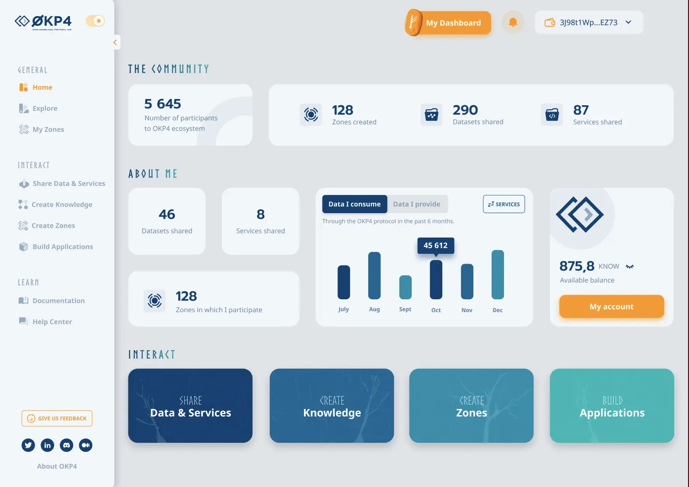

# Dataverse Web Portal

> 🔭 Dataverse Portal for the [OKP4 network](https://okp4.network).

 [](https://github.com/okp4/portal/actions/workflows/lint.yml)
 [](https://conventionalcommits.org)
 [](https://github.com/okp4/.github/blob/main/CODE_OF_CONDUCT.md)
 [](https://www.typescriptlang.org/)
 [](https://nextjs.org/)
 [](https://github.com/prettier/prettier)
 [![license][bsd-3-clause-image]][bsd-3-clause]
 [![cc-by-sa-4.0][cc-by-sa-image]][cc-by-sa]

## Purpose

🚀 Get ready to dive into the Dataverse! 💥 This portal is your gateway to an endless world of digital resources! 🪐 Explore the [Dataspaces](https://blog.okp4.network/what-is-a-data-space-b26ba51596b0), use, and contribute with datasets, algorithms, storage, and computational power!

[](https://okp4.network)

These instructions will get you a project up and running on your local machine for development and testing purposes.

### Prerequisites

Be sure to have the following properly installed:

- [Node.js](https://nodejs.org/ru/) `v18.13` ([hydrogen](https://nodejs.org/ru/blog/release/v18.13.0/))
- [yarn](https://yarnpkg.com)

### Setup

🚚 Install the dependencies and build the project:

```sh
yarn

yarn build
```

### Environment variables

The project relies on several environment variables for proper functioning. These variables should be set in a file named `.env.local` at the root of the project.
Checkout [nextjs documentation](https://nextjs.org/docs/basic-features/environment-variables) for more.

```shell
# The title of the application that will be displayed in the browser's title bar.
APP_TITLE=
# A comma-separated list of keywords relevant to the application (used by search engines).
APP_KEYWORDS=
# A brief description of the application (used by search engines).
APP_DESCRIPTION=
```

Note that the `.env.local` file is not tracked by version control and should not be committed to the repository.

### Launch

Run the server with the following command line.

```sh
yarn start
```

The portal will be available at <http://localhost:3000>.

## License

The OKP4 documentation portal is open source and [3-Clause BSD][bsd-3-clause] licensed.

The contents of the documentation (e.g. the `.md` files in the `/docs` folder) is [Creative Commons Attribution-ShareAlike 4.0 International][cc-by-sa] licensed.

## You want to get involved? 😍

Please check out OKP4 health files:

- [Contributing](https://github.com/okp4/.github/blob/main/CONTRIBUTING.md)
- [Code of conduct](https://github.com/okp4/.github/blob/main/CODE_OF_CONDUCT.md)

[bsd-3-clause]: https://opensource.org/licenses/BSD-3-Clause
[bsd-3-clause-image]: https://img.shields.io/badge/License-BSD_3--Clause-blue.svg?style=for-the-badge
[cc-by-sa]: https://creativecommons.org/licenses/by-sa/4.0/
[cc-by-sa-image]: https://i.creativecommons.org/l/by-sa/4.0/88x31.png
